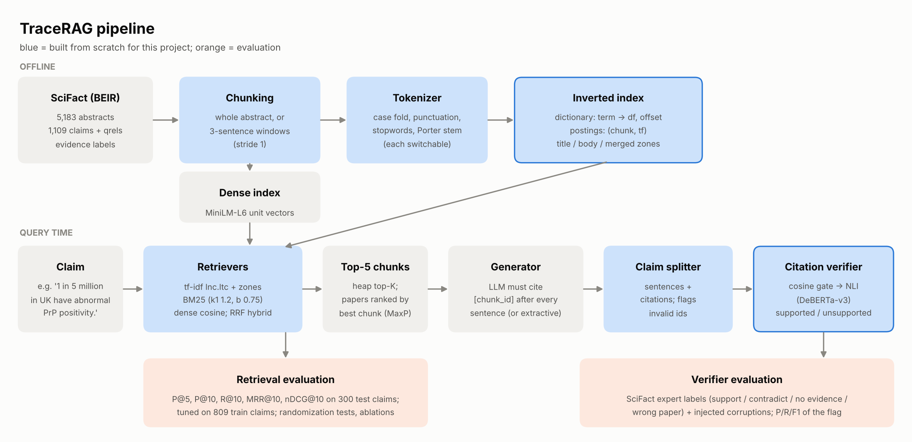
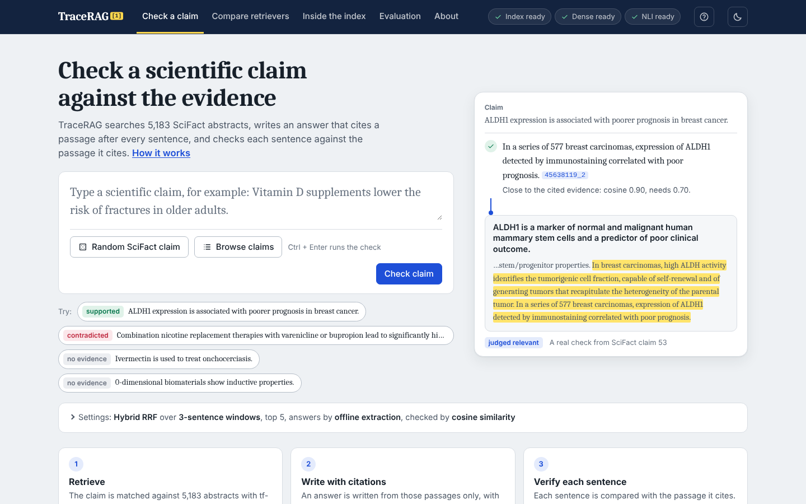
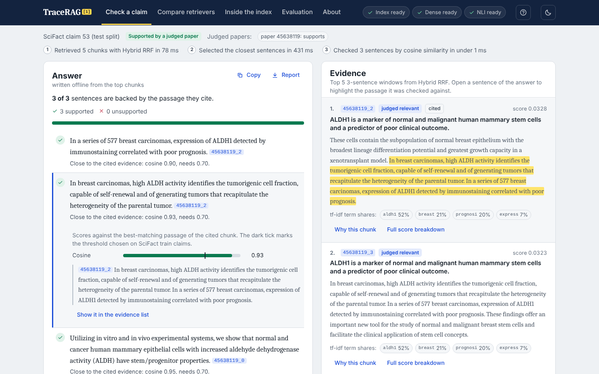
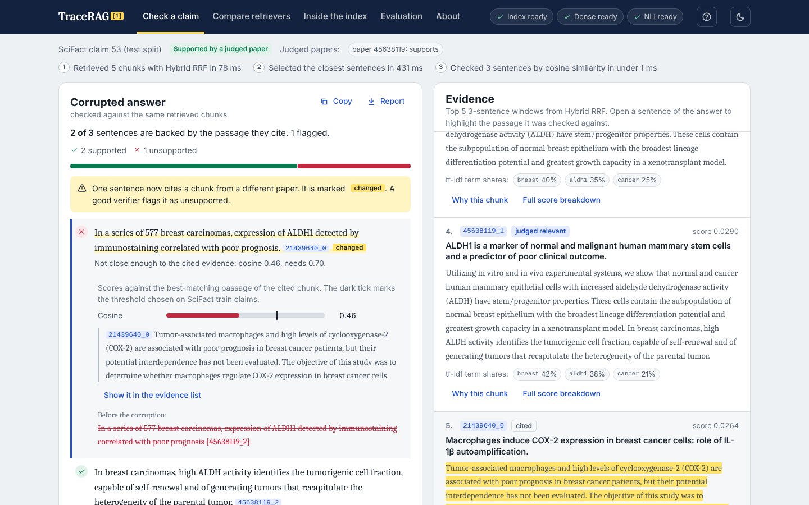
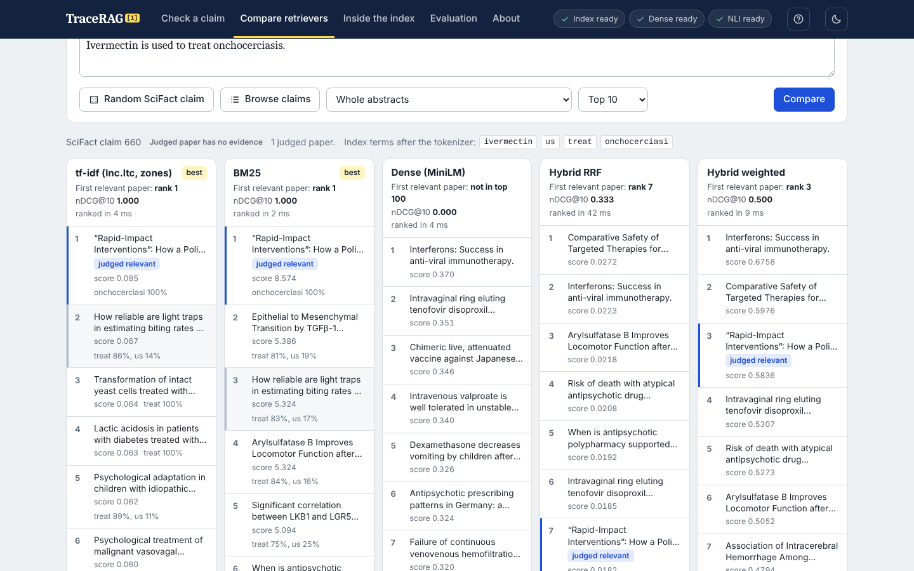
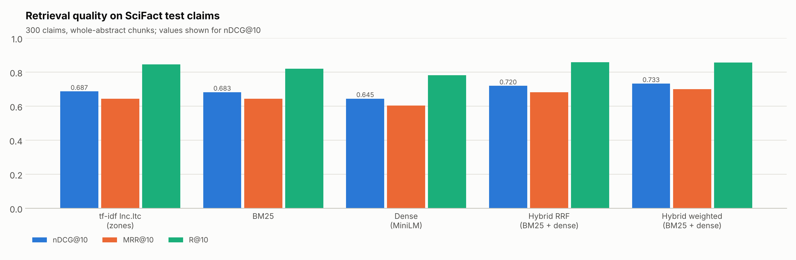

# TraceRAG

A retrieval-augmented system for scientific claims in which every answer sentence has to cite the chunk it came from, and a verifier then checks whether that chunk really backs the sentence. It runs on BEIR SciFact: 5,183 paper abstracts and 1,109 expert-written claims (300 test, 809 train).

The project has three parts:

1. **Retrieval built from scratch.** A tokenizer, an inverted index (dictionary + postings, with separate title and body zones), lnc.ltc tf-idf with weighted zones, and BM25 on the same postings. These are compared with MiniLM dense retrieval and two hybrids (reciprocal rank fusion and a weighted score blend).
2. **Generation with forced citations.** The LLM sees five chunks and must put `[chunk_id]` after every sentence or answer "Not enough evidence." Any OpenAI-compatible API works (Groq, Gemini, OpenAI, OpenRouter, a local Ollama model), so does Claude, and there is an offline extractive mode that needs no key.
3. **A claim-level citation verifier.** Each sentence is checked against the windows of the chunk it cites, first with cosine similarity and then with an NLI model. It is evaluated on SciFact's own expert evidence labels and on answers corrupted on purpose.



## Start it

You need Python 3.10 to 3.14; 3.13 is a good choice ([python.org](https://www.python.org/downloads/); on Windows tick "Add python.exe to PATH" while installing). PyTorch does not publish packages for newer Python versions yet, and the start files pick a supported version if you have several.

- **Windows:** double-click `start_windows.bat`.
- **macOS / Linux:** run `./start_mac_linux.sh` in a terminal.

The first run creates a private environment in `.venv` and installs the packages (5 to 10 minutes, mostly PyTorch), then opens http://127.0.0.1:8000 in your browser. Later runs start in a few seconds. To do the same by hand:

```bash
python -m venv .venv
.venv\Scripts\activate            # Windows (macOS/Linux: source .venv/bin/activate)
pip install -r requirements.txt
python run_app.py
```

The zip already contains the SciFact data (`data/raw/scifact/`) and the MiniLM embeddings of the 5,183 whole abstracts (`data/cache/`). The embeddings of the 34,718 sentence windows are left out to keep the zip small: on first start the app computes them once in the background and saves them, which takes roughly 5 minutes on a recent laptop and up to 20 on a slow 2-core machine. The top bar shows the progress, and until they are ready the app uses BM25 wherever they would be needed. On first use the app also downloads two models from Hugging Face: MiniLM (90 MB, needed for dense retrieval and the offline answer writer) and the NLI checker (570 MB). tf-idf and BM25 work at once. Start with `python run_app.py --no-nli` to skip the NLI model.

## The web app



| Page | What it does |
|---|---|
| Check a claim | Retrieves chunks, writes an answer that cites one after every sentence, and checks each sentence. Open a sentence to see its scores against the threshold and the exact passage it was checked against, highlighted in the cited chunk. Edit the answer and re-check it, or corrupt one sentence on purpose (negate it, swap its citation, add a fabricated sentence) and watch the verifier react. Copy the answer or download the whole check as a Markdown report. Settings choose the retriever, the chunking, how many chunks the writer sees, the answer writer (offline or an LLM API) and the verifier. |
| Compare retrievers | One claim through tf-idf, BM25, dense and both hybrids side by side, with SciFact's judged papers marked, per-claim nDCG@10, and a click-through explanation of every score. |
| Inside the index | The tokenizer step by step, any term's dictionary entry and postings list, and a full lnc.ltc / BM25 / dense score breakdown that is checked against the retriever's own score. |
| Evaluation | All result tables and interactive charts, including the sparse-vs-dense scatter: click a dot to open those claims in the comparison. |
| About | Pipeline diagram, live status of every component, and the tuned settings. |

The question-mark button in the top bar opens a short tour of all five pages. The backend is a FastAPI service (`src/api/`); its endpoints are documented at http://127.0.0.1:8000/docs while the app runs. Answers can come from the offline extractive writer or from any LLM API (Groq, Gemini, OpenAI, OpenRouter, Claude, a local Ollama model): pick it under Settings on the Check page and paste a key, or set the key as an environment variable before starting. Options: `--port 8080`, `--no-browser`, `--no-nli` (skip the 570 MB NLI model), `--host 0.0.0.0` (open to your network).





## Results on the 300 test claims

Whole-abstract chunks, so the numbers line up with published BEIR results. Every setting (title weight, fusion weight, verifier thresholds) was chosen on the 809 train claims; the test split was only used to report.

| Retriever | P@5 | P@10 | R@10 | MRR@10 | nDCG@10 (95% CI) |
|---|---|---|---|---|---|
| tf-idf lnc.ltc, title/body zones (own index) | 0.163 | 0.093 | 0.846 | 0.644 | 0.687 (0.646–0.728) |
| BM25 (own index) | 0.162 | 0.091 | 0.820 | 0.644 | 0.683 (0.639–0.725) |
| Dense, all-MiniLM-L6-v2 | 0.164 | 0.088 | 0.783 | 0.605 | 0.645 (0.599–0.691) |
| Hybrid RRF, BM25 + dense | 0.175 | 0.096 | 0.858 | 0.683 | 0.720 (0.677–0.761) |
| Hybrid weighted, BM25 + dense | 0.174 | 0.096 | 0.857 | 0.700 | **0.733** (0.691–0.774) |



- Hybrid RRF beats BM25 by 0.037 nDCG@10 (paired randomization test on per-claim scores, p = 0.001) and dense retrieval by 0.075 (p < 0.001). The weighted blend adds another 0.013 over RRF (p = 0.026).
- Our tf-idf and BM25 are statistically tied (p = 0.57). Getting tf-idf there took one change: a title weight of 0.1 instead of the usual 1. With equal weights, nDCG@10 drops to 0.594, and at 3x the title it falls to 0.514, because a title has about ten index terms, so one matching word already gives it a large cosine.
- Sanity checks on the plumbing: the dense row reproduces the official MTEB result for all-MiniLM-L6-v2 on SciFact to four decimals (nDCG@10 0.6451, R@10 0.7833, MRR@10 0.6047), our BM25 scores 0.683 where the Anserini "flat" BM25 reference scores 0.679, and `tests/test_metrics.py` checks every metric against trec_eval, including a rescoring of the saved run files in `results/runs/`.

Full tables, ablations and significance tests: [results/retrieval_results.md](results/retrieval_results.md). Everything in one file: [results/RESULTS.md](results/RESULTS.md).

### What the ablations show

| Change (test nDCG@10) | tf-idf | BM25 | Dense | Hybrid RRF |
|---|---|---|---|---|
| Default (stemming on, stopwords removed, whole abstracts) | 0.687 | 0.683 | 0.645 | 0.720 |
| Stemming off | 0.659 | 0.666 | | |
| Stopwords kept | 0.691 | 0.684 | | |
| 3-sentence windows instead of whole abstracts | 0.672 | 0.680 | 0.682 | 0.723 |

Stemming is worth about 0.02–0.03. Removing stopwords does not help on this collection. Sentence windows mainly help the dense model (+0.037, against +0.003 for the hybrid and small losses for the sparse models), which fits the fact that MiniLM cuts its input at 256 word pieces and many abstracts are longer than that. Retrieval is much harder for claims whose cited paper holds no evidence (SciFact's "NEI" claims): hybrid RRF reaches 0.884 nDCG@10 on SUPPORT claims and 0.496 on NEI claims.

### Sparse vs dense, claim by claim

BM25 ranks the first relevant paper higher on 87 claims, MiniLM on 73, and they tie on 140. Claims where BM25 wins share 56% of their index terms with the relevant paper; claims where dense wins share 43% (permutation test, p = 0.0005). Two extremes from [results/winner_analysis.md](results/winner_analysis.md):

- Claim 660, "Ivermectin is used to treat onchocerciasis": BM25 puts the paper first on the rare word *onchocerciasis*; MiniLM does not have it in its top 100.
- Claim 1, "0-dimensional biomaterials show inductive properties": no claim term appears in the relevant paper. MiniLM still ranks it 5th (the paper's closest sentence is about nanoparticles and quantum dots); BM25 never finds it.

### Citation verifier

**A. SciFact expert labels.** Each item pairs a claim with a paper: annotated as supporting it (138 test pairs), annotated as contradicting it (71), cited for the claim but holding no evidence (130), or the top BM25 paper that is not judged relevant, which stands in for a swapped citation (124). The verifier must flag everything except the first kind.

| Checker | Threshold (from train) | Precision | Recall | F1 | Macro-F1 | AUROC |
|---|---|---|---|---|---|---|
| Baseline: flag every sentence | | 0.702 | 1.000 | 0.825 | 0.412 | 0.500 |
| Cosine, MiniLM | cos < 0.70 | 0.828 | 0.757 | 0.791 | 0.682 | 0.782 |
| NLI, DeBERTa-v3-small | *run step 6 below* | | | | | |
| Cosine gate + NLI | *run step 6 below* | | | | | |

Precision, recall and F1 are for the "unsupported" flag. Because 70% of the items are unsupported, flagging everything already scores F1 0.825, so thresholds are chosen by macro-F1 (the mean of the F1 for both classes) and the baseline row stays in the table.

The cosine checker catches wrong papers (82%) and cited papers with no evidence (85%), but only 48% of contradictions, and it flags 37% of correctly supported claims. Typical miss, claim 274: the claim says combination therapy gives "significantly higher long-term abstinence rates at 52 weeks"; the paper says "Neither outcome was significantly different at 52 weeks." Same words, opposite meaning, cosine 0.86.

**B. Corrupted answers.** Thirty generated answers (offline extractive mode), each corrupted three ways. The cosine checker flags 93% of swapped citations and 100% of fabricated sentences, but only 3% of negated sentences, while flagging 2% of the untouched ones. Negation is the case NLI exists for. The demo shows it live: `python scripts/demo.py --qid 53 --inject negate` turns "increased aldehyde dehydrogenase activity" into "decreased" and the cosine checker still passes it at 0.94.

Details and failure cases: [results/verifier_results.md](results/verifier_results.md).

## Rebuilding everything from the command line

Python 3.10 to 3.14. On Linux, pip pulls the large CUDA build of PyTorch; `pip install torch --index-url https://download.pytorch.org/whl/cpu` first gets the small CPU build.

```bash
python -m venv .venv
.venv\Scripts\activate            # Windows
source .venv/bin/activate         # macOS / Linux
pip install -r requirements.txt

python scripts/build_index.py --dense --ablations   # 1. download SciFact, chunk, index, embed
python -m src.eval.run_retrieval_eval               # 2. tuning on train, test tables, ablations
python -m src.eval.winner_analysis                  # 3. sparse vs dense per claim
python -m src.generate.run_generation               # 4. cited answers for 30 test claims (offline)
python scripts/demo.py --qid 53 --inject negate     # 5. live demo
python -m src.eval.run_verifier_eval                # 6. verifier: cosine, NLI and cascade
python scripts/run_all.py                           # or: steps 1-4 and 6 in one go
python run_app.py                                   # the web app (see above)
pip install -r requirements-dev.txt                 # once, for the tests and the notebook
pytest                                              # 85 tests
```

Times measured on a 2-core cloud CPU: indexing 30 s, MiniLM encoding about 20 minutes (skipped for embeddings already in `data/cache/`, and much faster on a laptop with more cores or any GPU), retrieval evaluation 4 minutes, verifier with cosine only 7 minutes. The NLI stage scores about 16,000 premise/hypothesis pairs; expect 10–20 minutes on a laptop CPU, and its predictions are cached in `data/cache/` so reruns are quick.

Stop the web app before running these scripts; when you start it again it picks up the new results and thresholds.

If the BEIR server is down, `build_index.py` falls back to the Hugging Face copy. If both fail, download `scifact.zip` from the BEIR link in `config.py`, save it as `data/raw/scifact.zip` and rerun.

### Using a real LLM

The offline extractive mode copies the chunk sentences closest to the claim, so every sentence it writes is supported by construction. For real answers, set a key and pick a model:

```bash
# Groq or Gemini (both have free tiers), OpenAI, OpenRouter: any OpenAI-compatible API
set GROQ_API_KEY=...                  # Windows cmd; PowerShell: $env:GROQ_API_KEY="..."; macOS/Linux: export
python -m src.generate.run_generation --llm groq --model <model id from your provider> --sleep 2

set ANTHROPIC_API_KEY=...
python -m src.generate.run_generation --llm anthropic          # defaults to claude-haiku-4-5-20251001

python -m src.generate.run_generation --llm ollama --model <local model>   # no key, runs locally
```

Answers are cached, so repeated runs cost nothing. With LLM answers the corruption test can no longer assume the original sentences are supported: label them with `python scripts/label_answers.py results/generation/answers_<tag>.jsonl` (split the work between team members and compare a shared subset), then rerun step 6.

## Troubleshooting

| What you see | What to do |
|---|---|
| "TraceRAG needs Python 3.10 to 3.14" | Install Python 3.13 from python.org, tick "Add python.exe to PATH", run the start file again. |
| "Port 8000 is already in use" | Another copy is running. Close it, or start with `python run_app.py --port 8001`. |
| The yellow bar says the NLI model could not load | The computer could not reach Hugging Face. Everything else works; the verifier falls back to cosine similarity. Connect to the internet and restart, or start with `--no-nli`. |
| The Dense pill shows a percentage | The sentence-window embeddings are being computed (first start only; they are saved in `data/cache/`). BM25 is used until they are ready. |
| Package installation fails on Windows | Use 64-bit Python 3.10 to 3.14 and run `start_windows.bat` again. |
| Installation on Linux downloads several GB | pip picks the CUDA build of PyTorch there. For CPU only, first run `.venv/bin/pip install torch --index-url https://download.pytorch.org/whl/cpu`, then the start script. |
| The page is blank | Use a current browser (Chrome, Edge, Firefox or Safari). The page needs JavaScript. |

## Demo commands for the video

The web app covers the whole demo: check a claim, corrupt its answer, compare retrievers on claims 660 and 1, then open "Inside the index" for postings and the score arithmetic. The same steps work from the terminal:

```bash
python scripts/demo.py --postings tumor                    # dictionary entry: df, idf, postings with tf
python scripts/demo.py --qid 53                            # retrieve -> cited answer -> verdict per sentence
python scripts/demo.py --qid 53 --inject negate            # the verifier on a corrupted answer
python scripts/demo.py --qid 660 --retriever bm25 --chunking whole    # BM25 finds it on one rare word ...
python scripts/demo.py --qid 660 --retriever dense --chunking whole   # ... MiniLM does not
python scripts/demo.py --qid 1 --retriever bm25 --chunking whole      # no shared words: BM25 misses ...
python scripts/demo.py --qid 1 --retriever dense --chunking whole     # ... MiniLM ranks it 5th
python scripts/demo.py --qid 274 --llm groq --model <m>    # a real LLM answer
python scripts/demo.py --interactive
```

`notebooks/walkthrough.ipynb` recomputes one claim's tokens, ltc query vector, lnc document vector and cosine score by hand and asserts that they equal the library's numbers. It is the clearest thing to screen-record for the "show postings, weights and scores" part.

## How it maps to the rubric

| Rubric item | Where it is |
|---|---|
| IR principles (30) | `src/index/inverted_index.py` (dictionary, postings, zones), `src/retrieve/tfidf.py` (lnc.ltc, term-at-a-time scoring, heap top-K), `src/retrieve/bm25.py`, the "Inside the index" page, `demo.py --postings`, the notebook; `tests/test_retrieval.py` reproduces IIR Example 6.4 (score 0.80) and checks scoring against a brute-force implementation |
| Novelty (10) | claim-level verifier (`src/verify/`), gold benchmark built from SciFact annotations plus injected corruptions (`src/eval/run_verifier_eval.py`), per-claim winner analysis (`src/eval/winner_analysis.py`) |
| Working system (20) | the web app (`python run_app.py`, backend in `src/api/`, UI in `web/`), `scripts/run_all.py`, `scripts/demo.py`, `pytest` |
| Evaluation (15) | `results/retrieval_results.md` (baselines, CIs, significance, ablations), `results/verifier_results.md` |
| Track relevance (5) | every answer sentence is traced to a chunk and checked |
| Report and video (10 + 10) | figures in `results/*.png` and `report/pipeline.png`; demo commands above |

## Project layout

```
run_app.py                   starts the web app
start_windows.bat            double-click start on Windows (creates .venv on first run)
start_mac_linux.sh           the same for macOS and Linux
data/raw/scifact/            the BEIR SciFact files (shipped)
data/cache/                  MiniLM embeddings (whole abstracts shipped; sentence windows computed on first start)
config.py                    every path, model name and hyperparameter
src/api/engine.py            web backend: indexes, models and their readiness, every operation the API offers
src/api/server.py            FastAPI routes, request validation, JSON responses, static files
web/                         the browser UI (plain HTML, CSS and JavaScript modules, no build step)
src/ingest/load_scifact.py   download (BEIR, fallback Hugging Face), verify counts, load
src/ingest/chunking.py       sentence splitter, whole-abstract and sentence-window chunks
src/index/tokenizer.py       case fold, punctuation, NLTK stopwords, Porter stemmer (each switchable)
src/index/inverted_index.py  dictionary + postings per zone (title, body, merged), save/load, print_postings
src/index/dense_index.py     MiniLM embeddings with an on-disk cache
src/retrieve/base.py         heap top-K, chunk -> paper aggregation (MaxP)
src/retrieve/tfidf.py        lnc.ltc with weighted zones, per-term explanation
src/retrieve/bm25.py         BM25 (k1 1.2, b 0.75)
src/retrieve/dense.py        cosine retrieval
src/retrieve/hybrid.py       RRF and min-max weighted fusion
src/retrieve/factory.py      build any retriever by name with tuned settings
src/generate/rag.py          prompt, answer(), offline extractive generator
src/generate/llm.py          Anthropic and OpenAI-compatible backends with retries and caching
src/generate/run_generation.py
src/verify/splitter.py       answer -> sentences + cited ids (handles "[12]." and ". [12]")
src/verify/checker.py        cosine, NLI and cascade checkers, verdict rules
src/verify/nli.py            NLI cross-encoder wrapper (label order read from the model config)
src/verify/inject.py         swap_citation, add_fabricated, negate
src/explain/contrib.py       per-term score shares, lexical overlap
src/eval/metrics.py          P@k, R@k, MRR, nDCG, randomization test, bootstrap CI
src/eval/run_retrieval_eval.py, run_verifier_eval.py, winner_analysis.py, plots.py
scripts/                     build_index, run_all, demo, label_answers, make_pipeline_diagram
notebooks/walkthrough.ipynb  one claim, every number by hand
tests/                       unit and API tests incl. trec_eval and textbook cross-checks
results/                     tables (.csv/.md), figures (.png/.svg), TREC run files, per-claim scores
```

## Design decisions worth defending

- **No tuning on test.** Title weight, fusion weight and verifier thresholds are picked on the 809 train claims (`results/tuning_train.csv`, `results/tuned_params.json`).
- **Papers, not windows, are scored.** SciFact judges papers. With sentence windows, a paper's score is its best window (MaxP); otherwise five windows of one relevant paper could fill the top five and inflate P@5.
- **Verifier labels come from experts, not from us.** SciFact annotates which papers support or contradict each claim, so the verifier gets a 463-pair test set without hand labelling. The corruption test adds the cases SciFact lacks (fabricated sentences, swapped citations inside an answer).
- **Evidence windows.** The verifier compares a sentence with the paper title and every pair of consecutive sentences, not the whole chunk. Pairs gave the best cosine AUROC on train (`results/verifier_window_ablation.csv`).
- **Cascade.** Cosine is cheap and catches off-topic citations; NLI is slower and catches contradictions. The gate skips NLI when the cosine is clearly too low.

## Limitations

- The shipped results do not include the NLI rows; step 6 adds them on any machine that can download the model. Until then the web app's NLI verifier uses default thresholds (P(entail) 0.5, cosine gate 0.3) instead of tuned ones.
- The web app is meant for one person on their own machine. It has no login, and API keys typed into it go to your local server only, for that request.
- The extractive generator is a baseline, not an LLM. Results with an API model need the hand labels described above for exact precision.
- The "wrong paper" negatives are the top BM25 papers that SciFact did not judge relevant. A few may in fact support the claim, which would count against the verifier.
- With sentence windows, the top five chunks often come from a single paper, so answers rarely combine sources.
- A sentence that merges facts from two cited chunks can fail the check, since each window is judged on its own.
- The stopword list removes "not" and "no", so sparse retrieval cannot tell a claim from its negation. That is acceptable for finding papers, and it is one reason the verifier works on raw text.
- The sentence splitter is rule-based and occasionally splits at a person's initials.

## Next steps (major project)

Cross-encoder reranking after the hybrid; fine-tuning a verifier on the corruption data; larger corpora (FiQA, NFCorpus, your own PDFs); LLM-as-judge for answer quality; a FastAPI service with a vector database; and an agent loop that re-retrieves when the verifier flags a sentence.

## Data, models and references

- SciFact via BEIR (Thakur et al., 2021); the Hugging Face copy is listed under CC BY-SA 4.0. Claims and evidence labels: Wadden et al., 2020.
- `sentence-transformers/all-MiniLM-L6-v2` (Apache-2.0) and `cross-encoder/nli-deberta-v3-small` (Apache-2.0; 91.65% SNLI test accuracy on its model card).
- Lewis et al. (2020), Retrieval-Augmented Generation for Knowledge-Intensive NLP Tasks, NeurIPS.
- Thakur et al. (2021), BEIR: A Heterogeneous Benchmark for Zero-shot Evaluation of Information Retrieval Models, NeurIPS Datasets and Benchmarks.
- Wadden et al. (2020), Fact or Fiction: Verifying Scientific Claims, EMNLP.
- Gao et al. (2023), Enabling Large Language Models to Generate Text with Citations, EMNLP.
- Rashkin et al. (2023), Measuring Attribution in Natural Language Generation Models, Computational Linguistics.
- Laban et al. (2022), SummaC: Re-Visiting NLI-based Models for Inconsistency Detection in Summarization, TACL.
- Manning, Raghavan and Schütze (2008), Introduction to Information Retrieval, ch. 6 (lnc.ltc, zones).
- Robertson and Zaragoza (2009), The Probabilistic Relevance Framework: BM25 and Beyond.
- Cormack, Clarke and Büttcher (2009), Reciprocal Rank Fusion Outperforms Condorcet and Individual Rank Learning Methods, SIGIR.
- Reimers and Gurevych (2019), Sentence-BERT, EMNLP. He, Gao and Chen (2023), DeBERTaV3, ICLR.
- Smucker, Allan and Carterette (2007), A Comparison of Statistical Significance Tests for Information Retrieval Evaluation, CIKM.
- Kamalloo et al. (2024), Resources for Brewing BEIR: Reproducible Reference Models and an Official Leaderboard, SIGIR (BM25 reference scores). Muennighoff et al. (2023), MTEB, EACL (MiniLM reference score).
